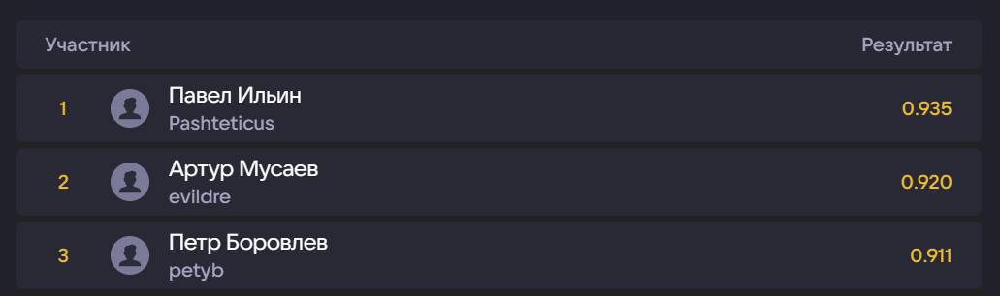

# ML Reference

## Решение задачи с [хакатона](https://miem.hse.ru/imsit/summer_school) от VK и ИМШ ВШЭ (3 место)

Команда: Ларин Иван, Георгий Абрамов, Пётр Боровлев.

## Задача

Разработайте модель машинного обучения для предсказания пола пользователя по рекламным данным VK, используя информацию о запросах, геолокации и URL. Необходимо предсказать пол для пользователей из тестового набора, опираясь на предоставленные таблицы с данными о пользователях, их запросах и геоинформации.

Метрика: ROC-AUC.

---

Для +1% (2 место) нужно было заметить, что данные в train и test выборках пересекаются.

Для 1 места нужно было использовать pytorch lifestream + сделать ансамбль catboost-ов.
